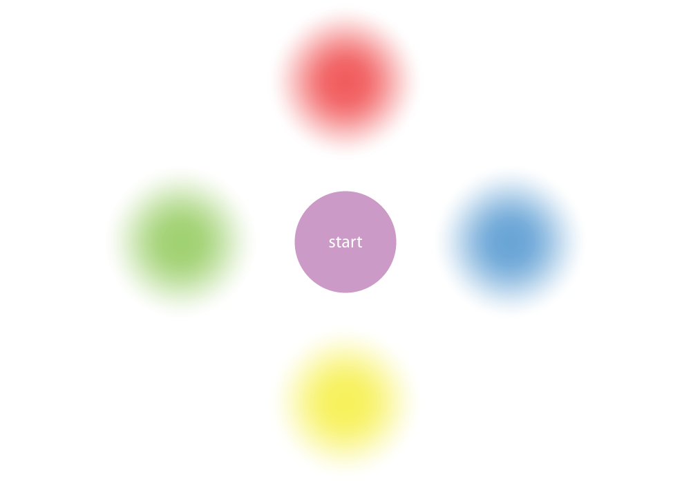
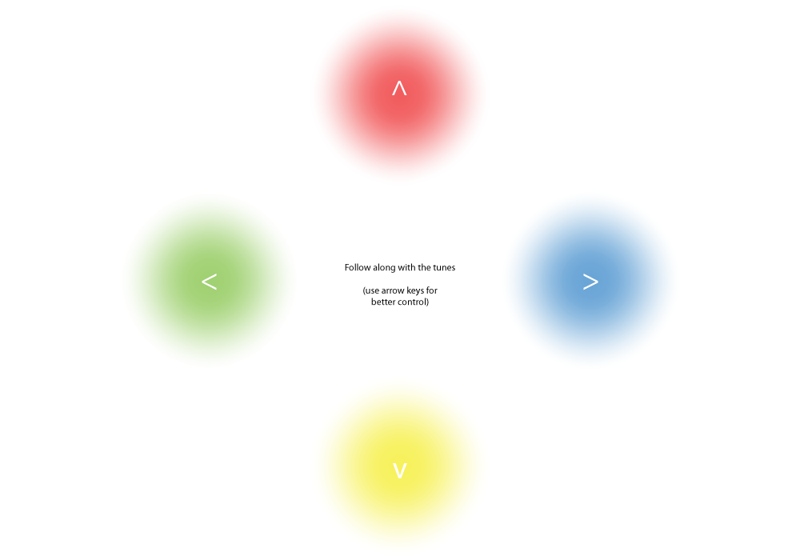

# SIMON

## Introduction

Simon is a game of memory, based on sounds and colors! It was initally launched in 1978 at Studio 54 in New York City and was an immediate success, becoming a pop culture symbol of the 1970s and 1980s.

Traditionally, the tones were chosen to be harmonic. I remember, as a child, being sucked into this game because of the harmonies. It felt like I was playing an instrument and learning a song. 

## Tasks for users

- This is a Human vs computer game
- The human hits start button to initialize game
- The computer (Simon) responds with the first note/color of the sequence
- The user has to mimic that exact note/color (by clicking it or possibly using key commands for a smoother interface)
- After the user makes their move, the computer repeats that first note/color and adds another one (chosen at random) as the next one in the sequence
- The user then has to mimic that sequence and so on until they mess up 
- The computer could keep score based on how long the sequence is, so the higher your score, the better you did

#### Some Specs

- Traditionally the colors and corresponding notes are:
  - Blue | E-note
  - Yellow | C#-note
  - Red | A-note
  - Green | E-note (octave lower than Blue)

**Bonus features**

- Some sweet CSS animations when interacting with it
- Can use arrow keys or click orbs when it is your turn
- Orbs change design on mobile device from orbs to full-screen blocks, arrow keys still work on regular computers
- Orbs grow on regular computers to fill the screen - colors visually take over each other, making the game increasingly difficult

## Special Instructions

- Please play with Chrome, currently this game is not equipped to work on Safari or FireFox browsers :(
- Sadly, this means no phone capabilities quite yet, stay tuned for updates!

## Process

### Wireframes
 
- Start the game

- initial instructions shown to show user how to play

- some hover effects happen as played

### Structure of site

Based on my wireframes, I built a quick structure for the game with HTML/CSS, before coding any Javascript features.

### MVP (Minimum Value Product)

When approaching the Javascript, I broke the game down into a series of smaller steps. Using this pseudocode, I filled in what the steps called for and started from there. Much testing was involved in a browser as my code was revised to work.

Some challenges I faced at first was the way properties are stored. In my event listeners for the user's turn, the keypress (or click) was being stored, even after I reset the user's array. I was able to remove the storage by removing the event listener each time it is added:

`$(document).off("keydown", checkKeyPress).on("keydown", checkKeyPress);`
`$('#blue').off('click',checkClick).click(checkClick);`

### Styling changes

Once I had it working properly, I re-evaluated the styles and added the orbs on desktop and the blocks for the phone.

### Feature changes

Finally, after the layout was styled and structured and the game itself worked properly. I added a feature that made the game a bit more interesting, visually, on desktop, by having the size of the orbs actually grow as the sequence got longer.

### Some features I'd like to add:

- Fully responsive, so that it works on all browsers and devices
- Simon plays faster as the sequence gets longer
- More visual tricks

## Special thanks to...

- <a href="https://en.wikipedia.org/wiki/Simon_(game)">_Wikipedia_</a> for specs and background of the game
- <a href="https://jsfiddle.net/yeghb8oo/">_JSFiddle_</a> for CSS animation (cd-pulse, I call bloom)-Link was posted by <a href="http://stackoverflow.com/questions/28623446/expand-bottom-border-on-hover">Philip Enc on Stack Overflow</a>
- Ahmet Can Güven, who posted on <a href="http://stackoverflow.com/questions/8489710/play-an-audio-file-using-jquery-when-a-button-is-clicked">_Stack Overflow_</a> about incorporating audio
- Cyrus Shahrivar, for his understanding of how event listeners are stored, even when they are seemingly removed
- GA's WDI for necessary background in Javascript and jQuery, and using them to build dynamic websites
